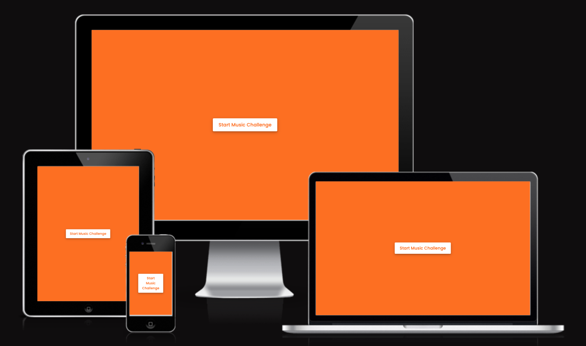
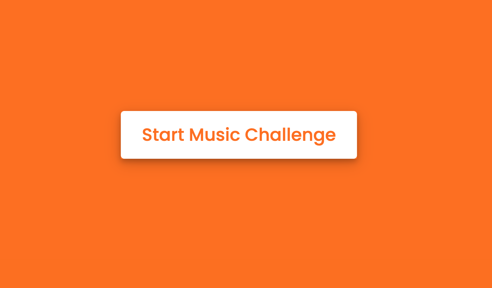
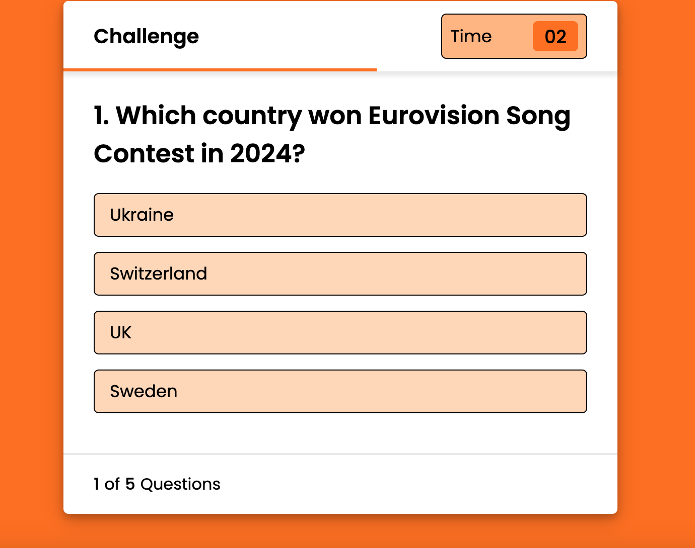
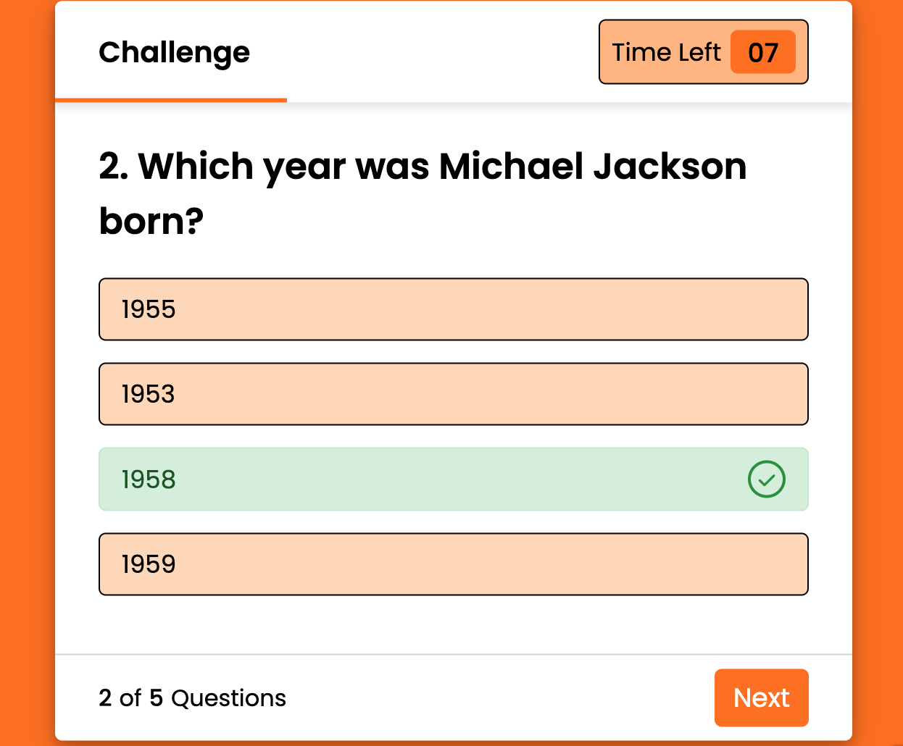
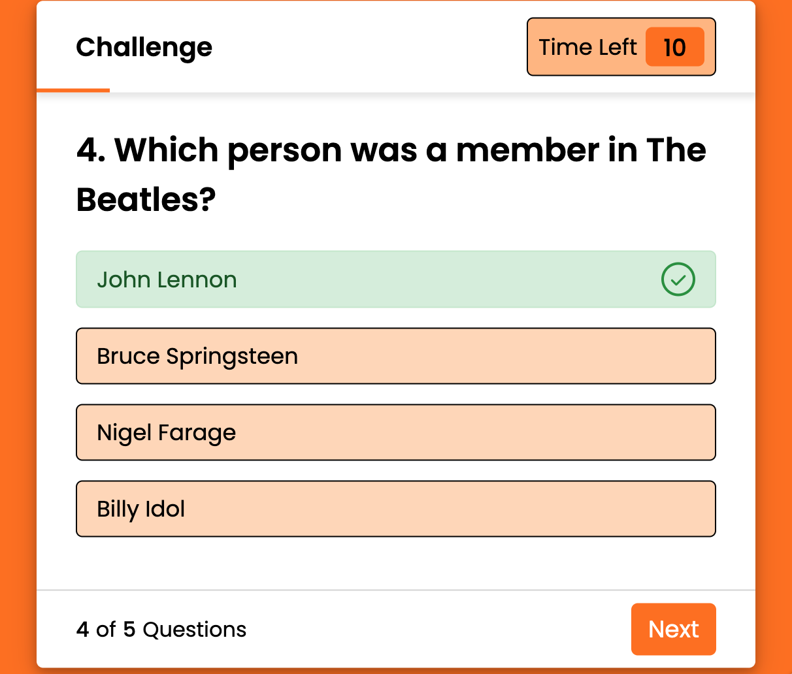
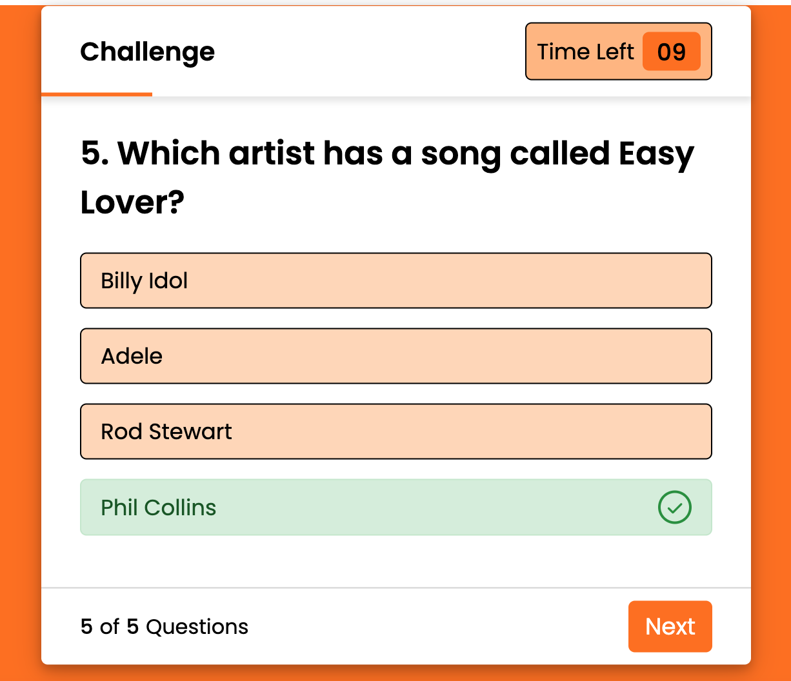
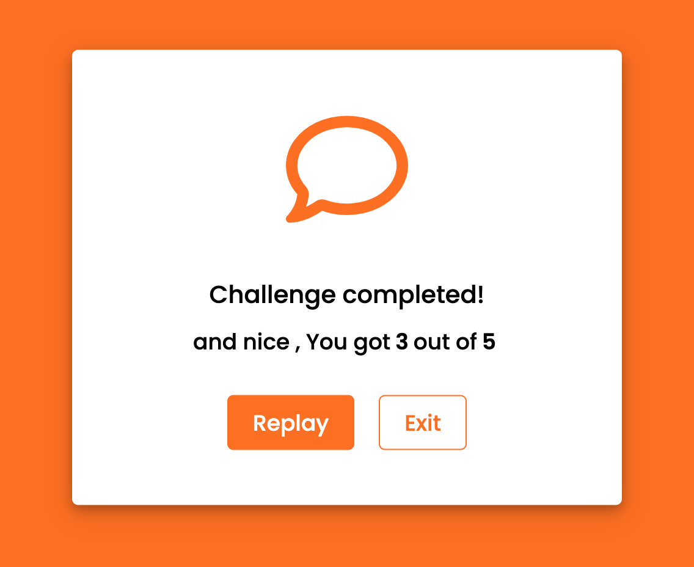

# Music Challenge
This is a music quiz game created to entertain people who admire music. The idea behind the quiz was to make it as clean and simple as possible wihtout images since i wanted to master the skillset of being able to implement a similiar framework for a corporate business. For example an ecommerce store who wants feedback from their customers etc.
## Features
### The Landing Page
* The landing page consist with a simple and clean button to start the challenge whith orange background.

* The theme colors are inspired by Code Institute which are white, orange and little bit of black.

### The Game

