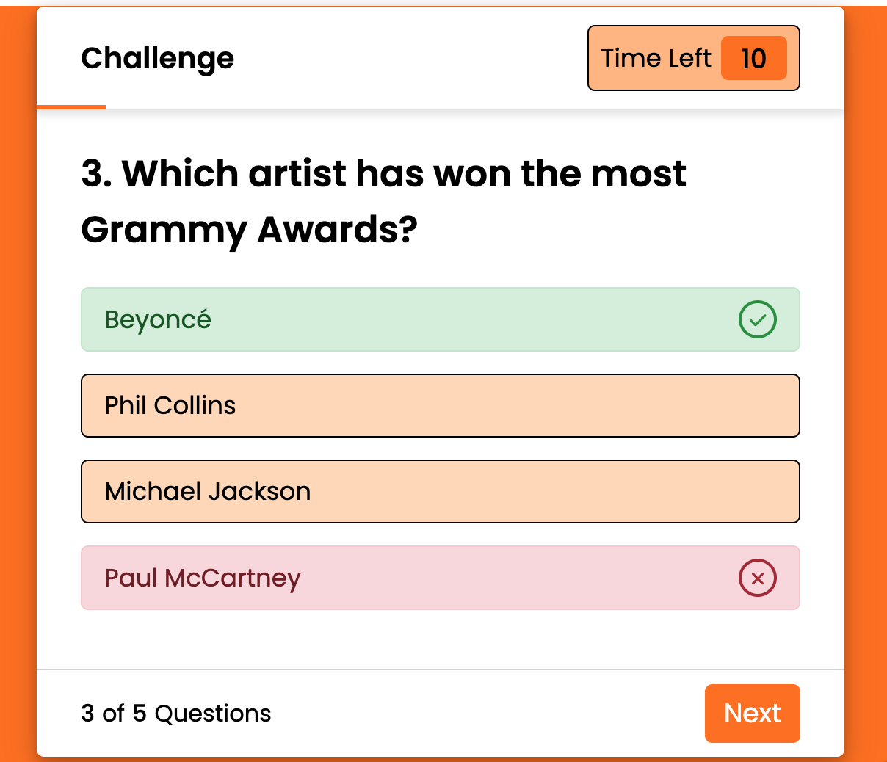

# Music Challenge
This is a music quiz game created to entertain people who admire music. The idea behind the quiz was to make it as clean and simple as possible wihtout images since i wanted to master the skillset of being able to implement a similiar framework for a corporate business. For example an ecommerce store who wants feedback from their customers etc.
## Features
### The Landing Page
* The landing page consists with a simple and clean white button to start the challenge whith orange background.

* The theme colors are inspired by Code Institute which are white, orange and little bit of black.

### The Game

* The game will show the rules and some info for the music quiz challenge before it starts.

* The game contains five music related questions with a 10 seconds timer.

* The game has an orange line which gets from A to B in 15 seconds to give the user an indiaction of how much time it's left.

* Each question contains four possible answers where the user has to pick one answer.

* The game will show if the user picked the right or wrong answer and will also show which answer which was right for each question.

* Once all the questions have been answered the user will be able to see their score. The user can also choose if they want to exit or retry the challenge.

* The game also counts each questions page down to the left of the game and also uses that to explain the score in a detailed measurement.

## Features left to implement

* I wanted to make the orange line to go from A to B in 10 seconds instead of 15.

* I wanted to improve the design a lot more so the design looks much more original and different instead of a standard format. Unfortunatley i wasn't able to completed before the 29th May 2024 due to medical conditions.

## Testing

* The Javascript codes has been tested on JSHint Javascript Validator: https://jshint.com/

* The CSS codes has been tested on W3C CSS Validator: https://jigsaw.w3.org/css-validator/

* The HTML codes has been tested on W3C HTML Validator: https://validator.w3.org/

* The game has been tested on lighthouse and you can see the results above.